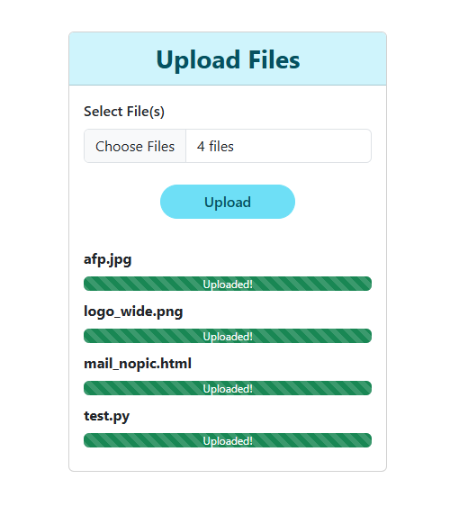

# 📁 LAN File Uploader Flask Webapp

A simple web application built with **Flask**, allowing you to upload files from one device to another over the **same local network**.

---

## ✅ Features

- 🔗 **LAN Access**: Run on your local machine and access it from any other device connected to the same WiFi.
- 📤 **Multiple File Uploads**: Select and upload multiple files at once.
- 🚀 **Sequential Uploads**: Files are uploaded one by one with individual progress indicators.
- 📊 **Real-time Progress Bar**: See upload progress live using AJAX and Bootstrap 5.

---

## 🛠️ Installation Guide

### 1. Clone the repository

```bash
git clone https://github.com/yourusername/lan-file-uploader.git
cd lan-file-uploader
```

### 2. Create a virtual environment (optional but recommended)

```bash
python -m venv venv
source venv/bin/activate   
# On Windows: 
.\venv\Scripts\activate
```

### 3. Install dependencies

```bash
pip install -r requirements.txt
```

### 4. Folder Structure

Ensure the following structure exists in your project:

```
lan-file-uploader/
│
├── app.py
├── forms.py
├── static/
│   ├── css/
│   │   └── bootstrap.min.css
│   ├── js/
│   │   ├── jquery-3.7.1.min.js
│   │   └── bootstrap.bundle.min.js
│   │   └── upload_handler.js
│   └── upload/         # Uploaded files will be saved here
│
└── templates/
    └── index.html
```

> 💡 You can download the required CSS and JS files from [Bootstrap](https://getbootstrap.com/docs/5.3/getting-started/download/) and [jQuery](https://jquery.com/download/).

### 5. Run the app

```bash
python app.py
```

The app will start on your local IP address, making it accessible from other devices on the same network.

---

## 📲 How to Use

1. Start the app.
2. Open a browser on another device connected to the same network.
3. Go to `http://<your-computer-ip>:5000`.
4. Select one or more files and click **Upload**.
5. Watch real-time progress per file and see success/failure messages instantly.

---

## 📷 Demo

<div align="center">
  
</div>

---

## 📝 License

MIT License – feel free to modify and distribute as needed.