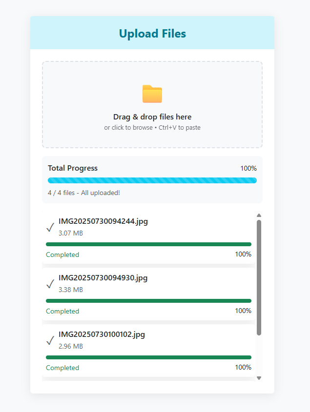

# LAN File Uploader

A modern Flask web application for uploading files over your **local network**. Built with Tailwind CSS for a clean, responsive design.

---

## Features

- **LAN Access** - Access from any device on your WiFi network
- **Multiple File Uploads** - Select and upload multiple files at once
- **Concurrent Uploads** - Upload up to 3 files simultaneously
- **Real-time Progress** - Individual and total progress bars with live updates
- **Dark Mode** - System-aware dark/light mode toggle
- **Drag & Drop** - Drop files directly onto the upload zone
- **Paste Support** - Copy files and paste with Ctrl+V
- **Speed & ETA** - See upload speed and estimated time remaining
- **Retry Failed Uploads** - One-click retry for failed uploads
- **Fully Responsive** - Works on desktop and mobile devices

---

## Installation

### 1. Clone and Navigate

```bash
git clone https://github.com/alfa-echo-niner-ait/lan-file-uploader.git
cd lan-file-uploader
```

### 2. Create Virtual Environment (Recommended)

```bash
python -m venv venv
# Linux/macOS:
source venv/bin/activate
# Windows:
.\venv\Scripts\activate
```

### 3. Install Dependencies

```bash
pip install flask
```

### 4. Project Structure

```
lan-file-uploader/
├── app.py              # Main Flask application
├── static/
│   ├── js/
│   │   └── upload_handler.js
│   └── upload/         # Uploaded files saved here
└── templates/
    └── index.html      # Main UI template
```

### 5. Run the App

```bash
python app.py
```

The app will start on `http://<your-ip>:5000`, accessible from all devices on your network.

---

## How to Use

1. **Start the app** - Run `python app.py`
2. **Access remotely** - Open `http://<computer-ip>:5000` on another device
3. **Select files** - Click, drag & drop, or paste (Ctrl+V)
4. **Review selection** - See file count before uploading
5. **Click Upload** - Start the upload process
6. **Monitor progress** - Watch real-time progress, speed, and ETA
7. **Retry if needed** - Use retry button for failed uploads

---

## Screenshots

<div align="center">
  
</div>

---

## License

MIT License - Free to use and modify.
